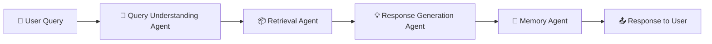
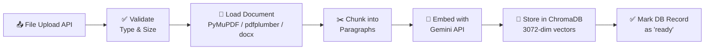
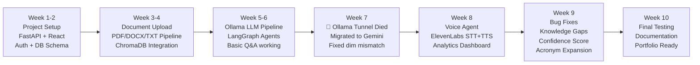

# AI-Powered Query Resolution System
## Complete Project Documentation Report

---

> [!IMPORTANT]
> This document is a complete technical record of the project — from architecture design to every bug encountered and solved during development. It is suitable for internship reports, college submissions, and portfolio presentations.

---

## 1. Project Overview

**Project Name:** AI-Powered Query Resolution & Knowledge Assistant System  
**Type:** Full-Stack AI Application (RAG-Based Chatbot with Voice Interface)  
**Domain:** Artificial Intelligence / Natural Language Processing / Full-Stack Engineering  
**Duration:** June 2026 – September 2026  
**Developed By:** Nandini Sonar (AIML Intern, Infosys Springboard)

### What is this Project?

The Query Resolution System is an intelligent, AI-powered platform that allows users to upload their own private documents (PDFs, Word files, CSVs, text files) and then ask natural-language questions about them through a chat interface or a hands-free voice interface.

Unlike general-purpose AI chatbots like ChatGPT, this system is **strictly grounded** — it only answers from the documents you provide. It will never hallucinate or make up information from outside the uploaded knowledge base.

Think of it as building your own private, searchable, AI-powered assistant for your company's HR documents, FAQ manuals, employee handbooks, or any other internal knowledge base.

---

## 2. Core Features

| Feature | Description |
|---|---|
| 📂 **Multi-Format Document Upload** | Upload PDFs, DOCX, TXT, and CSV files via drag-and-drop |
| 🤖 **Knowledge Assistant (Chat)** | Ask questions in text; get grounded AI answers with source citations |
| 🎤 **Voice Agent** | Speak your question; system transcribes, answers, and speaks back using ElevenLabs AI voices |
| 📊 **Query Analytics Dashboard** | Live charts for daily query volume, confidence trends, and query type breakdown |
| 🚨 **Knowledge Gap Tracker** | Automatically logs any question the system couldn't answer for admin review |
| 💬 **Chat History** | All conversations are saved, session-based, and re-readable |
| 🔐 **User Authentication** | Secure JWT-based login and registration with bcrypt password hashing |
| 🎯 **Confidence Scoring** | Every AI response shows a real-time confidence score based on vector similarity |
| 📌 **Source Citations** | Every answer shows which document and which specific chunk it was sourced from |
| 🔁 **Multi-Document Knowledge Base** | Upload multiple documents; the AI searches all of them simultaneously |

---

## 3. Technology Stack

### 3.1 Frontend (Client-Side)

| Technology | Version | Role |
|---|---|---|
| **React.js** | v18.3 | Core UI framework — component-based, reactive interface |
| **Vite** | v5.4 | Next-gen build tool replacing Create React App; extremely fast HMR |
| **React Router** | v6.26 | Client-side navigation between pages (Chat, Voice, Analytics, History) |
| **Zustand** | v4.5 | Lightweight global state management for auth tokens and user info |
| **Axios** | v1.7 | HTTP client for all API calls to the FastAPI backend |
| **Recharts** | v2.12 | SVG-based charting library for the Analytics Dashboard |
| **React Dropzone** | v14.2 | Drag-and-drop file upload component |
| **React Hot Toast** | v2.4 | Non-intrusive toast notifications for upload status, errors, etc. |

### 3.2 Backend (Server-Side)

| Technology | Version | Role |
|---|---|---|
| **Python** | 3.11+ | Primary programming language for the entire backend |
| **FastAPI** | v0.115 | Async REST API framework; auto-generates Swagger documentation |
| **Uvicorn** | v0.30 | ASGI server that runs the FastAPI application |
| **Pydantic** | v2.8 | Data validation for all request/response schemas |
| **SQLAlchemy** | v2.0 | ORM for interacting with the SQLite relational database |
| **SQLite** | — | Lightweight relational database for users, documents, chat sessions, analytics |
| **python-jose** | v3.3 | JWT token creation and verification for authentication |
| **passlib (bcrypt)** | v1.7 | Industry-standard password hashing |
| **python-multipart** | v0.0.12 | Required by FastAPI for parsing file upload form data |

### 3.3 AI, ML & RAG Pipeline

| Technology | Role |
|---|---|
| **Google Gemini API** (`gemini-3.5-flash-lite`) | The core Large Language Model (LLM) for understanding queries, generating answers, and asking clarifying questions |
| **Google Gemini Embeddings** (`gemini-embedding-001`) | Converts text chunks and queries into 3072-dimensional mathematical vectors for semantic search |
| **LangGraph** | Orchestration framework for the multi-agent pipeline; defines the state graph that routes queries through agents |
| **LangChain Core** | Supporting library for LangGraph node composition |
| **ChromaDB** | Open-source vector database that stores and searches all document chunk embeddings |
| **PyMuPDF (fitz)** | Primary PDF text extraction library |
| **pdfplumber** | Fallback PDF parser for scanned or image-based PDFs |
| **python-docx** | DOCX (Microsoft Word) document parser |
| **ElevenLabs API** | Premium AI voice service for both Speech-to-Text (STT) transcription and Text-to-Speech (TTS) synthesis |
| **httpx** | Async HTTP client used for all outbound API calls |

---

## 4. System Architecture

The system follows a clean **three-tier architecture**:

```
[Browser / React Frontend]
         ↕ REST API (JSON)
[FastAPI Backend + LangGraph Agent Pipeline]
         ↕
[ChromaDB Vector Store] + [SQLite Database] + [Google Gemini API] + [ElevenLabs API]
```

### 4.1 How a Query Flows Through the System (RAG Pipeline)

When a user types a question, it passes through a **4-stage LangGraph pipeline**:



**Stage 1 — Query Understanding Agent** (`app/agents/query_understanding.py`)
- Receives the raw user query and recent chat history
- Calls Gemini to classify the query as: `factual`, `procedural`, `comparative`, or `ambiguous`
- Resolves pronouns (e.g., "what about it?" → "what about the NPS contribution rate?")
- **Expands acronyms** (e.g., "NPS" → "National Pension System") for better vector search accuracy
- Outputs a clean, normalized query

**Stage 2 — Retrieval Agent** (`app/agents/retrieval.py` + `app/rag/retriever.py`)
- Embeds the normalized query into a 3072-dim vector using `gemini-embedding-001`
- Performs a cosine similarity search in ChromaDB across all uploaded document chunks
- Filters out any chunks below the similarity threshold
- Returns the top-K most relevant chunks with their similarity scores

**Stage 3 — Response Generation Agent** (`app/agents/response_generation.py`)
- Receives the retrieved chunks and normalized query
- Formats a grounded prompt: *"Only use the text below. Do not add outside information."*
- Sends to Gemini and gets a natural-language answer
- Calculates a **confidence score** from the average similarity of retrieved chunks
- If the answer is a "not found" response, it automatically clears citations and drops confidence to near zero

**Stage 4 — Memory Agent** (`app/agents/memory.py`)
- Saves the user query and AI answer to the SQLite database as a `Message`
- If the answer was empty/unhelpful OR if the confidence is below the threshold (75%), it **logs a Knowledge Gap**
- Updates session title on first message

---

### 4.2 Document Ingestion Pipeline

When a user uploads a file:



---

## 5. Problems Faced, Root Causes & Solutions

This section documents every major bug and challenge encountered during development, in the order they were discovered.

---

### Problem 1: Ollama Tunnel Expired — Chat Completely Broken

**Stage of Development:** After initial MVP

**What Happened:** The application was originally built using **Ollama** (a local LLM runner) as the AI backend. Ollama was exposed to the internet using an **ngrok** tunnel so the hosted frontend could access it. When ngrok's free 2-hour session expired, the tunnel URL died. Every single AI agent was still hardcoded to call that dead URL.

**Symptom:** The Knowledge Assistant returned the message *"Could you please provide more details? I didn't quite understand."* for every single question, regardless of what was asked. This was a hidden fallback message masking a `ConnectionError`.

**Root Cause:** A generic `except: return fallback_message` block was swallowing the real network error silently. The LLM was never actually called.

**Solution:** Fully migrated all three AI agents (`query_understanding.py`, `clarification.py`, `response_generation.py`) from raw `httpx` Ollama HTTP calls to the official **Google Gemini SDK** (`google-genai`), using the `gemini-3.5-flash` model. This eliminated the dependency on any local tunnel.

---

### Problem 2: ChromaDB Embedding Dimension Mismatch (768 vs 3072)

**What Happened:** After migrating to Gemini embeddings, new documents could not be added to ChromaDB. Every upload attempt failed immediately.

**Symptom:** `ERROR: Embedding dimension 3072 does not match collection dimensionality 768`

**Root Cause:** During early development, the system had created the ChromaDB collection using `nomic-embed-text` (an Ollama model that produces 768-dimensional vectors). ChromaDB "locks" a collection to the first vector dimension it receives. When we switched to `gemini-embedding-001` (which produces 3072-dimensional vectors), ChromaDB rejected all new embeddings as incompatible.

**Solution:** Wrote a Python reset script to programmatically:
1. Delete the `document_chunks` collection from ChromaDB.
2. Clear the `Document` table in SQLite (so the app doesn't show "orphan" document records without corresponding vectors).

After the reset, the first new document upload created a new ChromaDB collection correctly locked to 3072 dimensions.

---

### Problem 3: Gemini Embedding Model Returns 404 (API Version)

**What Happened:** After switching to Gemini, the embedding step for document uploads threw a 404 error.

**Symptom:** `HTTP/1.1 404 Not Found` → `models/text-embedding-004 is not found for API version v1beta`

**Root Cause:** The `text-embedding-004` model name was outdated. The API endpoint used (`/v1beta/`) does not support that model name. The correct model available in that API version is `gemini-embedding-001`.

**Solution:** Updated the `GEMINI_EMBED_MODEL` config value in `config.py` and `.env` from `text-embedding-004` to `gemini-embedding-001`.

---

### Problem 4: AI Response Truncated Mid-Sentence

**What Happened:** After getting the AI pipeline to work, longer answers would abruptly cut off in the middle of a sentence.

**Symptom:** The model would generate: *"The NPS contribution rate for government employees is..."* and then just stop.

**Root Cause:** The `response_generation.py` had `max_output_tokens=512` set in the Gemini API config. This was a leftover limit from Ollama days when small 1B-parameter models needed tight limits. For Gemini, 512 tokens is extremely short for a detailed answer.

**Solution:** Removed the `max_output_tokens` parameter entirely, allowing Gemini to generate responses of any length it deems appropriate.

---

### Problem 5: Rate Limit (429 Error) — Model Has Only 20 Free Requests/Day

**What Happened:** After a few tests, the system completely stopped working.

**Symptom:** `429 RESOURCE_EXHAUSTED: limit: 20, model: gemini-3.5-flash`

**Root Cause:** `gemini-3.5-flash` (a newer, more powerful model) has an extremely restrictive free tier of only **20 requests per day** per project. With 3 agents each making one API call per user query, we were hitting the limit in under 7 queries.

**Solution:** Switched all agents to `gemini-3.5-flash-lite`, which is a smaller, faster variant with a free tier of **1,500 requests per day** — more than enough for development and demos. The model name was also moved to the centralized `settings.GEMINI_CHAT_MODEL` config so it can be changed in one place via `.env` in the future.

---

### Problem 6: PDF Upload Returns "0 Chunks — No Text Extracted"

**What Happened:** Uploading a certain PDF document resulted in 0 chunks being created and the document status being marked as `error`.

**Symptom:** `INFO: Chunking 0 pages` → `ERROR: No text content extracted from document.`

**Root Cause:** The PDF happened to be a **scanned/image-based PDF** (the pages are actually images of text, not real text). PyMuPDF (`fitz`) is a text-extraction library — it reads the text layer of a PDF. If there is no text layer (only images), it correctly returns nothing.

**Solution:** Added `pdfplumber` as a **fallback parser**. After PyMuPDF returns 0 pages, the system now automatically tries `pdfplumber`, which uses more advanced heuristics to extract text from image-like PDFs. If both fail, a clear error message is shown to the user: *"This appears to be a scanned image PDF with no selectable text."*

---

### Problem 7: Knowledge Gaps Always Showing 0 (Not Being Logged)

**What Happened:** When asking a completely out-of-domain question (e.g., "what is the recipe for pav bhaji?"), the system correctly answered "I don't have that information" — but the Query Analytics dashboard always showed **0 Knowledge Gaps**.

**Root Cause:** The gap detection code in `memory.py` checked for the single exact string: `"i don't have enough information"`. However, Gemini phrases its "I don't know" responses differently every time: *"there is no information given about..."*, *"there is no mention of..."*, *"the text only discusses..."*. None of these matched the exact hardcoded phrase, so zero gaps were ever logged.

**Solution:** Replaced the single exact-phrase check with a comprehensive list of **20+ short keyword roots** that catch all Gemini variations:
- `"no information"` → matches *"no information given about"*, *"no information on"*, etc.
- `"no mention"` → matches *"there is no mention"*, *"no mention of"*
- `"only contains information"` → matches *"the text only contains information about NPS"*
- etc.

We also added a zero-retrieval trigger: if ChromaDB found zero matching chunks (`retrieval_confidence == 0.0`), it is automatically a Knowledge Gap regardless of the LLM's response.

---

### Problem 8: Confidence Score Was 87% for Unanswered Questions

**What Happened:** The confidence score showed `High (87%)` even when the AI said it didn't have the answer, AND the "Sources" section falsely showed 5 document excerpts.

**Root Cause:**
- **For confidence:** The `response_generation.py` confidence formula only checked for the old exact phrase `"don't have enough information"`. Since Gemini used different wording, the code thought the question *was* answered and applied the high-confidence formula (`avg_similarity * 1.05`).
- **For citations:** The code was building `citation_list` from all retrieved chunks *before* the LLM call. It then returned this list regardless of whether the LLM actually used those chunks to form an answer.

**Solution:** Applied the same broad phrase-matching to `response_generation.py`. When an unanswered response is detected:
1. Confidence is dropped to `avg_similarity * 0.1` (near zero).
2. `citation_list` is wiped to an empty array `[]`, so the frontend shows zero sources.

---

### Problem 9: "What is NPS?" vs "What is National Pension System?" Gave Different Answers

**What Happened:** Asking "What is National Pension System?" returned a perfect 95% answer. Asking "What is NPS?" returned "no information found."

**Root Cause:** Vector databases work by comparing the *mathematical meaning* of words. The embedding for the acronym `"NPS"` is mathematically very different from the full phrase `"National Pension System"`. The document uses the full phrase, so the acronym query failed to find the relevant chunks.

**Solution:** Updated the **Query Understanding Agent**'s system prompt to explicitly instruct Gemini to expand common acronyms before searching:
> *"Expand common acronyms to their full forms to improve search accuracy (e.g., expand 'NPS' to 'National Pension System', 'PF' to 'Provident Fund')."*

Now the query is silently rewritten before it hits the vector database.

---

### Problem 10: Resume Projects Not Found Despite Being in the Document

**What Happened:** After uploading a 2-page resume, asking "projects of Nandini Sonar in details" returned "there are no details mentioned regarding specific projects."

**Root Cause:** Direct database inspection confirmed the Projects section *was* successfully indexed into ChromaDB (in chunks #4 and #5 out of 5). The bug was in `response_generation.py`:

```python
top_chunks = chunks[:3]  # ← THIS WAS THE PROBLEM
```

This line was silently discarding chunks #4 and #5 — the ones containing the Projects section — before they were ever sent to the AI. This limit was originally put in place to protect small local Ollama models (which have tiny context windows of ~4,096 tokens) from crashing.

**Solution:** Removed the `[:3]` slice entirely. Since we migrated to Google Gemini, which has a **1,000,000 token context window**, all retrieved chunks can now be passed to the AI simultaneously without any risk.

---

## 6. Limitations of the Current System

| Limitation | Explanation |
|---|---|
| **Image-Only PDFs (OCR)** | While pdfplumber helps with some image PDFs, fully scanned documents with handwriting or poor quality scans will still fail. True OCR (like Tesseract or Google Vision API) would be needed. |
| **Free API Rate Limits** | `gemini-3.5-flash-lite` allows 1,500 requests/day for free. For heavy multi-user production use, a paid Google AI plan would be required. |
| **No Real-Time Web Search** | The system is strictly grounded in uploaded documents. It cannot search the internet for current information. |
| **Single-User ChromaDB** | All documents from all users go into the same ChromaDB collection. In a true multi-tenant production system, each user/organization should have an isolated collection. |
| **No Document Update** | Documents cannot be edited after upload. To update a document, you must delete and re-upload it. |
| **Sequential Agent Pipeline** | The 4-stage LangGraph pipeline runs sequentially. For production scale, parallel agent execution would improve response time. |
| **No Streaming Responses** | The full AI response is generated before being sent to the frontend. A streaming implementation would show text word-by-word for a better user experience. |

---

## 7. Development Timeline



---

## 8. Key Learning Outcomes

1. **RAG Architecture** — Understood how to build a full Retrieval-Augmented Generation system from scratch, including chunking strategy, embedding, vector search, and grounded generation.
2. **Multi-Agent Systems** — Designed and implemented a stateful LangGraph pipeline with 4 coordinated agents, each with a single responsibility.
3. **Debugging AI Systems** — Learned that AI bugs are often subtle (confidence scores look correct but are based on wrong logic) and require thinking about the full pipeline.
4. **Vector Database Concepts** — Gained hands-on experience with ChromaDB, cosine similarity, embedding dimensions, and threshold-based filtering.
5. **Production API Constraints** — Experienced real-world API rate limits, model deprecation, and the importance of centralizing configuration values.
6. **Full-Stack Integration** — Connected a React frontend to a Python/FastAPI backend with JWT auth, file uploads, streaming-ready APIs, and real-time analytics.

---

## 9. Repository & Resources

- **GitHub Repository:** [Development-of-AI-Based-Knowledge-Retrieval-Platform-with-Query-Resolution-System](https://github.com/NandiniSonar248/Development-of-AI-Based-Knowledge-Retrieval-Platform-with-Query-Resolution-System)
- **Backend:** Python + FastAPI at `http://localhost:8000`
- **Frontend:** React + Vite at `http://localhost:5173`
- **API Docs:** Auto-generated Swagger UI at `http://localhost:8000/docs`

---

*Document prepared by Nandini Sonar — September 2026*
